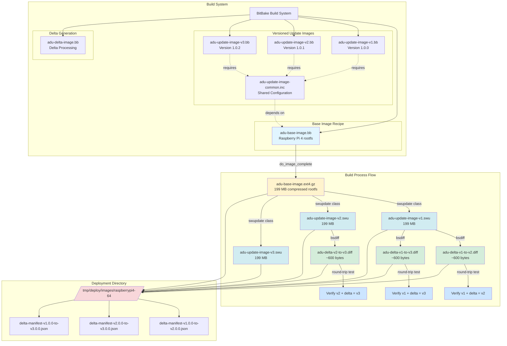

# Meta IoT Hub Device Update Delta Layer

This meta-layer provides recipes to build the Azure IoT Hub Device Update Delta project using the Yocto Project framework with Scarthgap release. It enables end-to-end delta update workflows including base image builds, versioned SWUpdate packages (.swu files), and binary delta generation with round-trip verification.

## Table of Contents

- [Overview](#overview)
- [System Architecture](#system-architecture)
- [Prerequisites](#prerequisites)
  - [Memory Requirements](#memory-requirements)
  - [Swap File Configuration](#swap-file-configuration)
- [Build Workflow](#build-workflow)
- [Delta Generation Process](#delta-generation-process)
- [Deployment and Artifacts](#deployment-and-artifacts)
- [Verification and Testing](#verification-and-testing)
- [Troubleshooting](#troubleshooting)

## Overview

The Azure IoT Hub Device Update Delta project enables efficient delta updates for IoT devices by creating and applying binary diffs. This meta-layer builds the core delta processing libraries with minimal dependencies focused on embedded Linux systems.

This layer orchestrates a complete delta update build system that:
- Builds a base rootfs image (`adu-base-image`)
- Creates multiple versioned SWUpdate packages (v1, v2, v3)
- Generates binary deltas between versions
- Performs round-trip verification to ensure delta integrity
- Deploys all artifacts to a unified deployment directory

## System Architecture



### Architecture Components

| Component | Purpose | Output |
|-----------|---------|--------|
| **adu-base-image** | Base Raspberry Pi 4 rootfs | `adu-base-image-raspberrypi4-64.ext4.gz` (199 MB) |
| **adu-update-image-common.inc** | Shared recipe configuration | Inherited by all versioned recipes |
| **adu-update-image-v1/v2/v3** | Versioned SWUpdate packages | `.swu` files with RSA signatures (199 MB each) |
| **adu-delta-image** | Delta generation & testing | `.diff` files (~600 bytes), manifests, verification |
| **DEPLOY_DIR_IMAGE** | Unified artifact deployment | `/tmp/deploy/images/raspberrypi4-64/` |

## Prerequisites

### System Requirements

- **Build Host**: Ubuntu 20.04 or 22.04 LTS (x86_64)
- **Disk Space**: Minimum 60 GB free space for Yocto builds
- **CPU**: Multi-core processor (6+ cores recommended for parallel builds)
- **Network**: Internet connection for fetching sources

### Memory Requirements

Delta generation using `bsdiff` is **memory-intensive**. The memory footprint is proportional to the size of the input files being compared.

**Memory Usage Patterns:**
- **Base rootfs size**: 199 MB compressed (adu-base-image.ext4.gz)
- **SWU file size**: 199 MB per versioned update image
- **bsdiff RAM requirement**: **~4-5x the size of the largest input file**
- **Actual memory needed**: **~1 GB RAM per delta generation task**

**Why So Much Memory?**

The `bsdiff` algorithm uses suffix array sorting to find common byte sequences between files. This requires:
1. Loading both input files into memory
2. Building suffix arrays (additional data structures)
3. Computing longest common subsequences
4. Managing temporary buffers during compression

For 199 MB SWU files, this can easily consume 800 MB - 1 GB per `bsdiff` process.

### Swap File Configuration

**What is a Swap File?**

A swap file (also called a page file on Windows) is disk space that the Linux kernel uses as "virtual memory" when physical RAM is exhausted. When RAM is full:
1. The kernel moves less-used memory pages to the swap file
2. Frees up RAM for active processes
3. Swaps pages back to RAM when needed

⚠️ **Swap is much slower than RAM** (disk I/O vs memory speed), but it prevents out-of-memory (OOM) failures during peak memory usage.

**Checking Current Swap:**

```bash
# Check swap status
free -h
swapon --show

# Example output:
#               total        used        free      shared  buff/cache   available
# Mem:           15Gi       2.3Gi       8.1Gi       100Mi       5.4Gi        12Gi
# Swap:         2.0Gi          0B       2.0Gi
```

**Increasing Swap File Size:**

If your system has insufficient swap (< 4 GB) and you encounter OOM errors during delta generation:

```bash
# 1. Disable current swap (if any)
sudo swapoff -a

# 2. Create a new 8 GB swap file
sudo fallocate -l 8G /swapfile
# Alternative if fallocate not supported:
# sudo dd if=/dev/zero of=/swapfile bs=1M count=8192

# 3. Set proper permissions (security requirement)
sudo chmod 600 /swapfile

# 4. Format as swap
sudo mkswap /swapfile

# 5. Enable the swap file
sudo swapon /swapfile

# 6. Verify new swap is active
free -h
swapon --show

# 7. Make permanent (survives reboot)
echo '/swapfile none swap sw 0 0' | sudo tee -a /etc/fstab
```

**Recommended Swap Sizes:**

| Physical RAM | Recommended Swap | Rationale |
|--------------|------------------|-----------|
| 4 GB | 8 GB | Handles 2-3 parallel delta generations |
| 8 GB | 4-8 GB | Moderate safety margin |
| 16 GB+ | 2-4 GB | Minimal swap needed |

**Build Performance Impact:**

- **Without sufficient swap**: Build fails with OOM (Out Of Memory) errors
- **With swap**: Build completes but may slow down during delta generation (disk I/O overhead)
- **Best practice**: Ensure enough physical RAM + moderate swap for safety

## Build Workflow

### Complete Build Command

```bash
cd ~/adu_yocto/iot-hub-device-update-yocto

./scripts/build.sh \
  -o ~/adu_yocto/out/build \
  -j 6 \
  --parallel-make 6 \
  --adu-git-branch user/nox-msft/vnext-delta \
  --adu-delta-git-branch user/nox-msft/scarthgap
```

**Build Parameters:**
- `-o`: Output directory for build artifacts
- `-j 6`: BitBake parallel tasks (6 recipes built simultaneously)
- `--parallel-make 6`: GNU make parallel compilation (6 parallel compiler processes per recipe)
- `--adu-git-branch`: Azure Device Update client repository branch
- `--adu-delta-git-branch`: Delta processor library repository branch

### Build Phases

The build executes in two main phases:

**Phase 1: ADU Update Images (v1, v2, v3)**

```
bitbake adu-update-image-v1 adu-update-image-v2 adu-update-image-v3
```

This phase:
1. Builds `adu-base-image` (base rootfs with all packages)
2. Creates `adu-base-image-raspberrypi4-64.ext4.gz` (199 MB compressed)
3. Generates three versioned SWUpdate packages:
   - `adu-update-image-v1-20251218031141.swu` (version 1.0.0)
   - `adu-update-image-v2-20251218031141.swu` (version 1.0.1)
   - `adu-update-image-v3-20251218031141.swu` (version 1.0.2)
4. Each .swu file is RSA-signed with the key from `keys/priv.pem`
5. Creates stable symlinks (e.g., `adu-update-image-v1.swu` → timestamped file)

**Phase 2: Delta Generation and Testing**

```
bitbake adu-delta-image
```

This phase:
1. Extracts rootfs from each .swu file
2. Generates binary deltas using `bsdiff`:
   - `adu-delta-v1-to-v2.diff` (~600 bytes)
   - `adu-delta-v2-to-v3.diff` (~600 bytes)
   - `adu-delta-v1-to-v3.diff` (~600 bytes)
3. Performs round-trip verification:
   - Applies delta to base image
   - Compares reconstructed image with target (must match exactly)
4. Creates ADU import manifests:
   - `delta-manifest-v1.0.0-to-v2.0.0.importmanifest.json`
   - `delta-manifest-v2.0.0-to-v3.0.0.importmanifest.json`
   - `delta-manifest-v1.0.0-to-v3.0.0.importmanifest.json`

### Build Output Example

```
NOTE: Tasks Summary: Attempted 6006 tasks of which 6003 didn't need to be rerun and all succeeded.
Building delta update artifacts (v1→v2, v2→v3, v1→v3)...
NOTE: recipe adu-delta-image-1.0-r0: task do_generate_delta_v1_v2: Succeeded
NOTE: recipe adu-delta-image-1.0-r0: task do_generate_delta_v2_v3: Succeeded
NOTE: recipe adu-delta-image-1.0-r0: task do_generate_delta_v1_v3: Succeeded
NOTE: recipe adu-delta-image-1.0-r0: task do_test_delta_v1_v2: Succeeded
NOTE: recipe adu-delta-image-1.0-r0: task do_test_delta_v2_v3: Succeeded
NOTE: recipe adu-delta-image-1.0-r0: task do_test_delta_v1_v3: Succeeded
NOTE: Tasks Summary: Attempted 6069 tasks of which 6063 didn't need to be rerun and all succeeded.
```

## Delta Generation Process

### Delta Generation Approach: DiffGenTool vs. Build-Time Python

The [iot-hub-device-update-delta](https://github.com/Azure/iot-hub-device-update-delta) project provides **DiffGenTool**, a .NET-based command-line utility for generating binary delta files from SWUpdate packages (.swu files). While DiffGenTool is the reference implementation for delta generation, this Yocto meta-layer uses a **Python-based approach** during the build process instead.

**Build-Time Delta Generation:**
- **Python implementation** (`simple-delta-gen.py` in `adu-delta-image.bb`) performs the same delta generation tasks as DiffGenTool
- Uses system `bsdiff` and `zstd` tools directly (already available in Yocto build environment)
- Eliminates .NET runtime dependency during the build process
- Enables delta generation as part of the BitBake build workflow

**Key Benefits:**

1. **End-to-End Verification During Build**
   - Generate delta files from v1→v2, v2→v3, v1→v3 automatically
   - Perform roundtrip verification: `base.swu + delta → target.swu` (must match exactly)
   - Catch delta generation bugs before deployment
   - Validate compression ratios and delta quality metrics

2. **Integrated Build Workflow**
   - Delta files generated alongside SWU update packages
   - No manual post-build step required
   - Consistent, reproducible delta artifacts
   - Statistics logs and import manifests created automatically

3. **Simplified Dependency Chain**
   - Avoids .NET SDK and runtime dependencies in Yocto build
   - Reuses existing build tools (bsdiff, zstd, python3)
   - Faster build times (no .NET compilation required)
   - Smaller build environment footprint

4. **Full Reconstruction Flow Testing**
   - Validates entire OTA delta update flow before device deployment
   - Ensures delta patches correctly reconstruct target images
   - Tests ADU import manifest generation
   - Verifies SWU compatibility across versions

**When to Use DiffGenTool:**

DiffGenTool remains the recommended choice for:
- **Post-build delta generation** - Creating deltas from existing SWU files outside the build system
- **CI/CD pipelines** - Automated delta generation in .NET environments
- **Manual delta creation** - Ad-hoc delta generation for testing or hotfixes
- **Windows environments** - Where .NET tooling is readily available

Both approaches produce **functionally equivalent** delta files that work with the Azure Device Update service and the delta processor libraries built by this layer.

### How Delta Generation Works

**Step 1: SWU File Extraction**

```python
# Extract rootfs from .swu package
def extract_swu(swu_file, output_dir):
    # .swu is a CPIO archive
    subprocess.run(['cpio', '-id'], stdin=open(swu_file, 'rb'), cwd=output_dir)
    # Extract sw-description and adu-base-image.ext4.gz
```

**Step 2: Binary Diff Generation**

```python
# Generate binary delta using bsdiff
def generate_delta(base_file, target_file, delta_file):
    # bsdiff creates a compressed binary patch
    subprocess.run(['bsdiff', base_file, target_file, delta_file])
    # Output: ~600 bytes for nearly identical rootfs images
```

**Step 3: Round-Trip Verification**

```python
# Verify delta correctness
def verify_delta(base_file, delta_file, expected_target):
    reconstructed = tempfile.mktemp()
    # Apply delta patch
    subprocess.run(['bspatch', base_file, reconstructed, delta_file])
    # Compare byte-for-byte
    assert filecmp.cmp(reconstructed, expected_target, shallow=False)
```

**Step 4: Manifest Creation**

```json
{
  "updateManifest": {
    "updateId": {
      "provider": "Azure",
      "name": "RaspberryPi4-Delta",
      "version": "2.0.0"
    },
    "updateType": "microsoft/swupdate:2",
    "installedCriteria": "2.0.0",
    "files": [
      {
        "filename": "adu-delta-v1-to-v2.diff",
        "sizeInBytes": 612,
        "hashes": {
          "sha256": "abc123..."
        }
      }
    ]
  }
}
```

## Deployment and Artifacts

### Deployment Directory Structure

All build artifacts are deployed to a unified directory:

```
~/adu_yocto/out/build/build/tmp/deploy/images/raspberrypi4-64/
├── adu-base-image-raspberrypi4-64-20251218031141.ext4.gz   (199 MB) - Base rootfs
├── adu-base-image-raspberrypi4-64.ext4.gz                  (symlink) - Stable link
│
├── adu-update-image-v1-20251218031141.swu                  (199 MB) - Version 1.0.0
├── adu-update-image-v1.swu                                 (symlink)
├── adu-update-image-v2-20251218031141.swu                  (199 MB) - Version 1.0.1
├── adu-update-image-v2.swu                                 (symlink)
├── adu-update-image-v3-20251218031141.swu                  (199 MB) - Version 1.0.2
├── adu-update-image-v3.swu                                 (symlink)
│
├── adu-delta-v1-to-v2.diff                                 (612 bytes) - Binary delta v1→v2
├── adu-delta-v2-to-v3.diff                                 (601 bytes) - Binary delta v2→v3
├── adu-delta-v1-to-v3.diff                                 (606 bytes) - Binary delta v1→v3
│
├── delta-manifest-v1.0.0-to-v2.0.0.importmanifest.json    (978 bytes) - ADU manifest
├── delta-manifest-v2.0.0-to-v3.0.0.importmanifest.json    (978 bytes) - ADU manifest
└── delta-manifest-v1.0.0-to-v3.0.0.importmanifest.json    (978 bytes) - ADU manifest
```

### Artifact Details

| Artifact Type | File Pattern | Size | Purpose |
|---------------|--------------|------|---------|
| **Base Image** | `adu-base-image-*.ext4.gz` | 199 MB | Compressed ext4 rootfs for Raspberry Pi 4 |
| **SWU Packages** | `adu-update-image-v*.swu` | 199 MB each | RSA-signed SWUpdate packages |
| **Delta Files** | `adu-delta-v*-to-v*.diff` | ~600 bytes | Binary patches (bsdiff format) |
| **Manifests** | `delta-manifest-*.json` | ~1 KB | Azure Device Update import manifests |
| **Symlinks** | `*.swu`, `*.ext4.gz` (no timestamp) | - | Stable references to latest build |

### Timestamped vs Stable Names

**Why Both?**

1. **Timestamped Files** (e.g., `adu-update-image-v1-20251218031141.swu`)
   - Unique identification for each build
   - Enables tracking specific build artifacts
   - Prevents accidental overwrites
   - Useful for archiving and rollback

2. **Stable Symlinks** (e.g., `adu-update-image-v1.swu`)
   - Delta generation scripts search for stable names
   - Simplifies referencing "latest" version
   - No need to know exact timestamp
   - Standard Yocto deployment pattern

### Verifying Deployed Artifacts

```bash
# List all deployed SWU files
ls -lh ~/adu_yocto/out/build/build/tmp/deploy/images/raspberrypi4-64/adu-update-image-v*.swu

# Check delta files
ls -lh ~/adu_yocto/out/build/build/tmp/deploy/images/raspberrypi4-64/*delta*

# Verify base image
ls -lh ~/adu_yocto/out/build/build/tmp/deploy/images/raspberrypi4-64/adu-base-image*.ext4.gz
```

**Expected Output:**

```
=== SWU Update Files ===
-rw-r--r-- 2 nox nox 199M Dec 18 03:14 adu-update-image-v1-20251218031141.swu
lrwxrwxrwx 2 nox nox   38 Dec 18 03:14 adu-update-image-v1.swu -> adu-update-image-v1-20251218031141.swu
-rw-r--r-- 2 nox nox 199M Dec 18 03:14 adu-update-image-v2-20251218031141.swu
lrwxrwxrwx 2 nox nox   38 Dec 18 03:14 adu-update-image-v2.swu -> adu-update-image-v2-20251218031141.swu
-rw-r--r-- 2 nox nox 199M Dec 18 03:14 adu-update-image-v3-20251218031141.swu
lrwxrwxrwx 2 nox nox   38 Dec 18 03:14 adu-update-image-v3.swu -> adu-update-image-v3-20251218031141.swu

=== Delta Files ===
-rw-r--r-- 1 nox nox 612 Dec 18 03:23 adu-delta-v1-to-v2.diff
-rw-r--r-- 1 nox nox 601 Dec 18 03:23 adu-delta-v2-to-v3.diff
-rw-r--r-- 1 nox nox 606 Dec 18 03:23 adu-delta-v1-to-v3.diff
-rw-r--r-- 1 nox nox 978 Dec 18 03:23 delta-manifest-v1.0.0-to-v2.0.0.importmanifest.json
-rw-r--r-- 1 nox nox 978 Dec 18 03:23 delta-manifest-v2.0.0-to-v3.0.0.importmanifest.json
-rw-r--r-- 1 nox nox 978 Dec 18 03:23 delta-manifest-v1.0.0-to-v3.0.0.importmanifest.json

=== Base Image ===
-rw-r--r-- 2 nox nox 199M Dec 18 03:14 adu-base-image-raspberrypi4-64-20251218031141.ext4.gz
lrwxrwxrwx 2 nox nox   53 Dec 18 03:14 adu-base-image-raspberrypi4-64.ext4.gz -> adu-base-image-raspberrypi4-64-20251218031141.ext4.gz
```

## Verification and Testing

### Automated Round-Trip Testing

The build system automatically performs round-trip verification for every delta:

```bash
# Example: Verifying delta v1→v2
1. Extract rootfs from adu-update-image-v1.swu  → v1.ext4.gz
2. Extract rootfs from adu-update-image-v2.swu  → v2.ext4.gz
3. Apply delta: bspatch v1.ext4.gz adu-delta-v1-to-v2.diff → reconstructed.ext4.gz
4. Compare: reconstructed.ext4.gz == v2.ext4.gz (byte-for-byte match)
5. ✅ Pass if identical, ❌ Fail otherwise
```

**BitBake Tasks for Verification:**

```
NOTE: recipe adu-delta-image-1.0-r0: task do_test_delta_v1_v2: Started
NOTE: recipe adu-delta-image-1.0-r0: task do_test_delta_v1_v2: Succeeded

NOTE: recipe adu-delta-image-1.0-r0: task do_test_delta_v2_v3: Started
NOTE: recipe adu-delta-image-1.0-r0: task do_test_delta_v2_v3: Succeeded

NOTE: recipe adu-delta-image-1.0-r0: task do_test_delta_v1_v3: Started
NOTE: recipe adu-delta-image-1.0-r0: task do_test_delta_v1_v3: Succeeded
```

### Manual Verification

If you need to manually verify a delta:

```bash
DEPLOY_DIR=~/adu_yocto/out/build/build/tmp/deploy/images/raspberrypi4-64

# 1. Extract base image from v1 SWU
mkdir -p /tmp/verify/v1
cd /tmp/verify/v1
cpio -idv < $DEPLOY_DIR/adu-update-image-v1.swu
gunzip adu-base-image-raspberrypi4-64.ext4.gz

# 2. Extract target image from v2 SWU
mkdir -p /tmp/verify/v2
cd /tmp/verify/v2
cpio -idv < $DEPLOY_DIR/adu-update-image-v2.swu
gunzip adu-base-image-raspberrypi4-64.ext4.gz

# 3. Apply delta to reconstruct v2
bspatch \
  /tmp/verify/v1/adu-base-image-raspberrypi4-64.ext4 \
  /tmp/verify/reconstructed.ext4 \
  $DEPLOY_DIR/adu-delta-v1-to-v2.diff

# 4. Compare reconstructed with original v2
diff /tmp/verify/reconstructed.ext4 \
     /tmp/verify/v2/adu-base-image-raspberrypi4-64.ext4

# Expected: No output (files are identical)
# If differences found: ❌ Delta verification FAILED
```

### Delta Size Analysis

Check delta compression efficiency:

```bash
DEPLOY_DIR=~/adu_yocto/out/build/build/tmp/deploy/images/raspberrypi4-64

echo "Delta Size Analysis:"
echo "===================="
printf "%-25s %10s %10s %10s\n" "Delta" "Size" "Base" "Ratio"
printf "%-25s %10s %10s %10s\n" "-----" "----" "----" "-----"

for delta in $DEPLOY_DIR/adu-delta-*.diff; do
    delta_name=$(basename $delta)
    delta_size=$(stat -c%s $delta)
    base_size=208666624  # 199 MB uncompressed
    ratio=$(echo "scale=2; ($delta_size / $base_size) * 100" | bc)
    printf "%-25s %10d %10d %9.2f%%\n" "$delta_name" $delta_size $base_size $ratio
done
```

**Expected Output:**

```
Delta Size Analysis:
====================
Delta                          Size       Base     Ratio
-----                          ----       ----     -----
adu-delta-v1-to-v2.diff         612  208666624      0.00%
adu-delta-v2-to-v3.diff         601  208666624      0.00%
adu-delta-v1-to-v3.diff         606  208666624      0.00%
```

**Interpretation:**
- Delta files are ~600 bytes for 199 MB base images
- Compression ratio: **0.0003%** (nearly identical rootfs images)
- This is expected for test builds where only version metadata changes
- Real-world deltas (package updates, config changes) will be larger but still significantly smaller than full images

### Testing on Target Device

To test delta updates on a Raspberry Pi 4:

1. **Flash base image (v1):**
   ```bash
   sudo dd if=adu-update-image-v1.swu of=/dev/sdX bs=4M status=progress
   ```

2. **Copy delta to device:**
   ```bash
   scp adu-delta-v1-to-v2.diff pi@raspberrypi:/tmp/
   ```

3. **Apply delta update:**
   ```bash
   # On the device
   sudo swupdate -i /tmp/adu-delta-v1-to-v2.diff
   sudo reboot
   ```

4. **Verify version after reboot:**
   ```bash
   cat /etc/adu-version
   # Expected: 1.0.1 (version 2)
   ```

## Troubleshooting

### Common Build Errors

#### Error: Out of Memory (OOM) During Delta Generation

**Symptoms:**
```
NOTE: recipe adu-delta-image-1.0-r0: task do_generate_delta_v1_v2: Failed
ERROR: adu-delta-image-1.0-r0 do_generate_delta_v1_v2: Killed
```

**Cause:** `bsdiff` requires ~1 GB RAM per delta generation task. Insufficient memory causes the kernel to kill the process.

**Solution:**
1. Check available memory: `free -h`
2. Increase swap file size (see [Swap File Configuration](#swap-file-configuration))
3. Reduce parallel build tasks: `-j 4` instead of `-j 6`
4. Build delta images sequentially (don't build all at once)

#### Error: SWU Files Not Found

**Symptoms:**
```
ERROR: adu-delta-image-1.0-r0 do_generate_delta_v1_v2: SWU file not found: adu-update-image-v1.swu
```

**Cause:** Versioned update images weren't built or deployed correctly.

**Solution:**
```bash
# Clean and rebuild update images
cd ~/adu_yocto/iot-hub-device-update-yocto
source yocto/poky/oe-init-build-env ~/adu_yocto/out/build

# Clean specific recipes
bitbake -c cleanall adu-update-image-v1
bitbake -c cleanall adu-update-image-v2  
bitbake -c cleanall adu-update-image-v3

# Rebuild
bitbake adu-update-image-v1 adu-update-image-v2 adu-update-image-v3

# Verify deployment
ls -lh tmp/deploy/images/raspberrypi4-64/adu-update-image-v*.swu
```

#### Error: Base Image Not Deployed

**Symptoms:**
```
ERROR: swupdate cannot find image file: adu-base-image.ext4.gz
```

**Cause:** `adu-base-image` was resolved from sstate cache but files weren't deployed.

**Solution:**
```bash
# Clean sstate and force rebuild
bitbake -c cleansstate adu-base-image
bitbake adu-base-image

# Verify deployment
ls -lh tmp/deploy/images/raspberrypi4-64/adu-base-image*.ext4.gz
```

#### Error: Conflicting Deployment Files

**Symptoms:**
```
ERROR: adu-update-image-v1-1.0-r0 do_deploy: Recipe adu-update-image-v1 is trying to install files into a shared area when those files already exist
```

**Cause:** Multiple deployment tasks (swupdate class + custom do_deploy) trying to deploy the same files.

**Solution:**
- Ensure `adu-update-image-common.inc` only inherits `swupdate` class
- Remove custom `do_deploy` task (swupdate class handles deployment automatically)
- Clean and rebuild:
  ```bash
  bitbake -c cleanall adu-update-image-v1 adu-update-image-v2 adu-update-image-v3
  bitbake adu-update-image-v1 adu-update-image-v2 adu-update-image-v3
  ```

### Build Performance Tips

1. **Use sstate cache:** Set `SSTATE_DIR` to persistent location (already configured in build.sh)
2. **Parallel builds:** Adjust `-j` based on CPU cores and RAM
3. **Clean selectively:** Use `cleanall` only for specific recipes, not entire build
4. **Monitor resources:** Use `htop` or `atop` during builds to watch memory/CPU usage

### Getting Help

If issues persist:

1. **Check build logs:**
   ```bash
   # Latest build log
   tail -100 /tmp/yocto-build-*.log
   
   # Recipe-specific logs
   cat ~/adu_yocto/out/build/build/tmp/work/*/adu-delta-image/*/temp/log.do_generate_delta*
   ```

2. **Enable debug output:**
   ```bash
   # Add to local.conf
   INHERIT += "buildhistory"
   BUILDHISTORY_COMMIT = "1"
   ```

3. **Report issues:**
   - GitHub Issues: [Azure/iot-hub-device-update-delta](https://github.com/Azure/iot-hub-device-update-delta/issues)
   - Include: Build log, recipe file, system specs (RAM, CPU, swap)

## What This Layer Provides

### Deliverables

This meta-layer builds and installs the following components:

| Component | Type | Installation Path | Description |
|-----------|------|-------------------|-------------|
| **libadudiffapi.a** | Static Library | `/usr/lib/libadudiffapi.a` | Core delta API library (archive) |
| **libadudiffapi.so** | Shared Library | `/usr/lib/libadudiffapi.so` | Core delta API library (shared) |
| **Delta Headers** | Development Headers | `/usr/include/azure-delta/` | Public API headers for delta operations |
| **applydiff** | Executable | `/usr/bin/applydiff` | Tool to apply delta patches to files |
| **dumpdiff** | Executable | `/usr/bin/dumpdiff` | Tool to dump delta patch contents (debug) |
| **extract** | Executable | `/usr/bin/extract` | Archive extraction utility |
| **makecpio** | Executable | `/usr/bin/makecpio` | CPIO archive creation tool |
| **recompress** | Executable | `/usr/bin/recompress` | Archive recompression utility |
| **zstd_compress_file** | Executable | `/usr/bin/zstd_compress_file` | Zstd compression wrapper |
| **Documentation** | Files | `/usr/share/ms-adu_diffs/` | LICENSE, README, and build notes |

### Supported Azure IoT Hub Device Update Delta Version

| Property | Value |
|----------|-------|
| **Repository** | https://github.com/Azure/iot-hub-device-update-delta |
| **Branch** | `user/nox-msft/scarthgap` |
| **Last Tested Commit** | `ab96585` |
| **Commit Message** | Fix ext2fs_file_get_current_physblock implementation |
| **Version Tag** | `lkg-34` (Last Known Good build #34) |
| **Date Last Tested** | December 15, 2025 |
| **Base Upstream Branch** | `main` (Preview 3.0.0 #24) |

### Build Artifacts

The layer produces two types of output packages:

1. **Runtime Package** (`${PN}`)
   - Executables and runtime files
   - Installable to target devices
   - Path: `/usr/bin/`, `/usr/share/`

2. **Development Package** (`${PN}-dev`)
   - Header files for application development
   - Path: `/usr/include/azure-delta/`

3. **Static Library Package** (`${PN}-staticdev`)
   - Static archive files for static linking
   - Path: `/usr/lib/`

### Key Features

- **Cross-architecture Support:** Builds for aarch64, armv7, x86-64
- **Minimal Dependencies:** Only essential libraries (zstd, bsdiff, cryptography)
- **Efficient Delta Processing:** Binary diff creation and application
- **Embedded-Optimized:** Small footprint suitable for IoT devices
- **Testing Support:** Includes unit tests via ptest framework

## Layer Dependencies

This layer depends on the following layers:

- **meta** (from poky)
- **meta-poky** (from poky)  
- **meta-yocto-bsp** (from poky)
- **meta-oe** (from meta-openembedded)
- **meta-networking** (from meta-openembedded)
- **meta-python** (from meta-openembedded)
- **meta-clang** (from meta-clang)

### Required External Dependencies

The following system dependencies must be available in your Yocto build:

1. **Core Libraries:**
   - `zlib` - Compression library
   - `libzstd` - Zstandard compression
   - `bzip2` - Bzip2 compression
   - `libgcrypt` - Cryptographic library
   - `openssl` - SSL/TLS library

2. **C++ Libraries:**
   - `fmt` - Modern formatting library
   - `jsoncpp` - JSON processing library
   - `googletest` - Unit testing framework (for tests)

3. **Build Tools:**
   - `cmake` >= 3.16
   - `ninja-build`
   - `pkgconfig`
   - C++20 capable compiler (GCC/Clang)

## Recipes Provided

### iot-hub-device-update-delta-processor

**File:** `recipes-azure/iot-hub-device-update-delta/iot-hub-device-update-delta-processor_1.0.bb`

**Description:** Main recipe that builds the Azure IoT Hub Device Update Delta processor libraries.

**Key Features:**
- Builds core delta processing libraries (`libdiffs.so`, `libdiff_api.so`)
- Includes comprehensive dependency management via PkgConfig
- Automated CMake configuration patching
- Tests enabled by default using ptest framework
- Tools subdirectories disabled to minimize dependencies

**Output:**
- Libraries: `/usr/lib/libdiffs.so`, `/usr/lib/libdiff_api.so`
- Headers: `/usr/include/azure-delta/`
- Tools: `/usr/bin/applydiff` (if tools are enabled)

### bsdiff

**File:** `recipes-support/bsdiff/bsdiff_1.0.bb`

**Description:** Custom bsdiff recipe providing binary delta functionality required by the main processor.

**Key Features:**
- CMake-based build system
- Shared library with proper -fPIC flags
- Custom pkgconfig file generation
- Integration with main recipe via PkgConfig detection

## Dependencies and Layer Customizations

This section documents all dependencies used by this layer, their versions, and how this meta-layer customizes or patches them.

### Dependency Matrix

| Dependency | Version | Type | Layer Source | Customization | Required For |
|-----------|---------|------|--------------|---------------|-------------|
| **zstd** | 1.5.x+ | Library | meta-oe | PkgConfig patch | Compression |
| **bsdiff** | 1.0 | Library | meta-iot-hub-device-update-delta | Custom recipe | Delta operations |
| **e2fsprogs** | 1.47.0 | Tool/Library | poky/meta | physblock patch | Ext4 filesystem support |
| **fmt** | 9.x+ | Library | meta-oe | None | String formatting |
| **jsoncpp** | 1.9.x+ | Library | meta-oe | PkgConfig wrapper | JSON parsing |
| **openssl** | 3.x+ | Library | meta-oe | None | SSL/TLS |
| **libgcrypt** | 1.10.x+ | Library | meta-oe | None | Cryptography |
| **googletest** | 1.11.x+ | Library | meta-oe | None | Unit testing |
| **cmake** | 3.16+ | Tool | native | None | Build system |
| **pkg-config** | 0.29+ | Tool | native | None | Dependency detection |

### Layer Customizations and Patches

#### 1. **e2fsprogs - physblock Patch**

**Location:** `recipes-devtools/e2fsprogs/e2fsprogs/0002-add-ext2fs_file_get_current_physblock.patch`

**Purpose:** Adds missing `ext2fs_file_get_current_physblock()` function to e2fsprogs library.

**Why Needed:** The upstream e2fsprogs 1.47.0 does not expose the current physical block number from an open file handle. This is needed for efficient ext4 delta generation to track block continuity.

**Implementation:** 
- Adds function declaration in `lib/ext2fs/ext2fs.h`
- Implements function in `lib/ext2fs/fileio.c` to return the internal `file->physblock` member
- Allows delta processor to optimize block-level change detection

**Affected Files:**
```
lib/ext2fs/ext2fs.h      - Added extern declaration
lib/ext2fs/fileio.c      - Added implementation
```

**Integration:** Applied via recipe append mechanism:
```bitbake
# File: recipes-devtools/e2fsprogs/e2fsprogs_1.47.0.bbappend
SRC_URI:append = " file://0002-add-ext2fs_file_get_current_physblock.patch"
```

**Status:** ✓ Stable - Upstream unlikely to accept this Azure-specific extension

---

#### 2. **zstd - PkgConfig Integration**

**Location:** `recipes-azure/iot-hub-device-update-delta/files/0001-use-pkgconfig-for-zstd.patch`

**Purpose:** Replaces CMake's `find_package()` with `pkg_check_modules()` for zstd library detection.

**Why Needed:** Yocto's zstd package only provides `.pc` (pkg-config) files, not CMake config files. Upstream build fails because it uses `find_package(zstd CONFIG REQUIRED)`.

**Changes:**
- CMakeLists.txt: `find_package(zstd REQUIRED)` → `pkg_check_modules(ZSTD REQUIRED libzstd)`
- Link libraries: `zstd::libzstd_static` → `${ZSTD_LIBRARIES}`
- Include paths: Auto-resolved via `${ZSTD_INCLUDE_DIRS}`

**Error Without Patch:**
```
CMake Error at io/compressed/CMakeLists.txt:22 (find_package):
  Could not find a package configuration file provided by "zstd"
```

**Status:** ✓ Required for Yocto - Upstream hasn't adopted pkg-config fallback

---

#### 3. **bsdiff - Custom Recipe**

**Location:** `recipes-support/bsdiff/bsdiff_1.0.bb`

**Purpose:** Provides bsdiff library as a Yocto package with PkgConfig integration.

**Why Needed:** bsdiff is not in standard Poky/meta-oe layers. Must be built and packaged for Yocto cross-compilation.

**Customizations:**
- **CMake build:** Configured for cross-compilation
- **fPIC flag:** Ensures Position-Independent Code for shared library
- **PkgConfig file:** Creates `bsdiff.pc` for pkg-config detection
- **Install paths:** Proper staging for use by dependent packages

**Key Recipe Features:**
```bitbake
S = "${WORKDIR}/git"
OECMAKE_SOURCEPATH = "${S}"

# Enable PIC for shared library
CFLAGS:append = " -fPIC"
CXXFLAGS:append = " -fPIC"

# Install pkg-config file
do_install:append() {
    install -d ${D}${libdir}/pkgconfig
    install -m 0644 ${B}/bsdiff.pc ${D}${libdir}/pkgconfig/
}
```

**PkgConfig Integration:** Enables delta processor to find bsdiff via:
```bash
pkg-config --cflags --libs bsdiff
```

**Status:** ✓ Complete - Fully integrated into Yocto build

---

#### 4. **jsoncpp - PkgConfig Wrapper**

**Location:** `recipes-azure/iot-hub-device-update-delta/files/0004-use-pkgconfig-for-libconfig.patch`

**Purpose:** Adds PkgConfig detection fallback for jsoncpp library.

**Why Needed:** jsoncpp may not provide CMake config files in all Yocto configurations. This ensures reliable detection.

**Implementation:**
```cmake
# CMakeLists.txt patch adds:
pkg_check_modules(JSONCPP jsoncpp)
if(NOT JSONCPP_FOUND)
    find_package(jsoncpp CONFIG REQUIRED)
endif()
```

**Fallback Strategy:**
1. Try pkg-config first (Yocto-friendly)
2. Fall back to CMake config if available
3. Fail with clear error if neither works

**Status:** ✓ Safe fallback - Doesn't break existing CMake support

---

### How Patches Are Applied

The meta-layer uses Yocto's **recipe append mechanism** and **file references** to apply customizations:

**Recipe Append Pattern:**
```bitbake
# File: recipes-devtools/e2fsprogs/e2fsprogs_1.47.0.bbappend
# Appends to standard poky recipe WITHOUT modifying it

SRC_URI:append = " file://0002-add-ext2fs_file_get_current_physblock.patch"
```

**Benefits:**
- ✓ Upstream poky layer remains untouched
- ✓ Changes are version-controlled in meta-layer
- ✓ Easy to maintain across Yocto releases
- ✓ Clear documentation of customizations

**File References:**
- Patch files stored in: `recipes-devtools/e2fsprogs/e2fsprogs/`
- Automatically found by Yocto's `file://` protocol
- Relative to recipe directory

---

### Dependency Resolution Strategy

**Problem:** Cross-compilation environment ≠ Native Linux environment

**Solution:** Use PkgConfig instead of CMake config files

**Why PkgConfig Works Better:**
- Simpler, text-based format (`.pc` files)
- Cross-compilation aware (staging paths)
- Widely supported in Yocto
- Better PKG_CONFIG_PATH handling

**Implementation in Recipe:**
```bitbake
export PKG_CONFIG_PATH = "${STAGING_LIBDIR}/pkgconfig"

EXTRA_OECMAKE = " \
    -DCMAKE_PREFIX_PATH=${STAGING_DIR_TARGET}/usr \
"
```

This ensures CMake finds pkg-config files in Yocto staging directories.

---

### Future Customizations

**Potential patches for upstream consideration:**

1. **zstd PkgConfig Support** - Propose to upstream as optional fallback
2. **e2fsprogs API Stability** - Consider upstreaming physblock function if widely needed
3. **jsoncpp Build Options** - May need updates for newer jsoncpp versions

**Version Compatibility:**
- Tested with: Yocto Scarthgap 5.0.x
- Compatible with: Poky Scarthgap recipes
- May require updates for future Yocto releases

---

## Build Instructions

### 1. Environment Setup

```bash
# Clone required repositories
git clone git://git.yoctoproject.org/poky -b scarthgap
git clone git://git.openembedded.org/meta-openembedded -b scarthgap  
git clone https://github.com/kraj/meta-clang -b scarthgap

# Initialize build environment
source poky/oe-init-build-env build-adu-delta
```

### 2. Configure bblayers.conf

Add the following layers to your `conf/bblayers.conf`:

```bitbake
BBLAYERS ?= " \
  /path/to/poky/meta \
  /path/to/poky/meta-poky \
  /path/to/poky/meta-yocto-bsp \
  /path/to/meta-openembedded/meta-oe \
  /path/to/meta-openembedded/meta-networking \
  /path/to/meta-openembedded/meta-python \
  /path/to/meta-clang \
  /path/to/meta-iot-hub-device-update-delta \
  "
```

### 3. Configure local.conf

Add these settings to your `conf/local.conf`:

```bitbake
# Enable tests
DISTRO_FEATURES:append = " ptest"

# Ensure C++20 support
TOOLCHAIN = "clang"
```

### 4. Build the Recipe

```bash
# Build the main recipe
bitbake iot-hub-device-update-delta-processor

# Or build for specific steps
bitbake -c configure iot-hub-device-update-delta-processor
bitbake -c compile iot-hub-device-update-delta-processor
```

## Technical Implementation Details

### Dependency Resolution Strategy

The recipe uses PkgConfig for dependency detection instead of CMake's find_package to ensure compatibility with Yocto's cross-compilation environment:

1. **Automated CMake Patching:** Uses sed scripts to replace `find_package()` calls with `pkg_check_modules()`
2. **Custom PkgConfig Files:** Creates missing .pc files for dependencies like bsdiff
3. **Include Directory Management:** Automatically adds include directories for dependencies

### Applied Patches and Fixes

The configure step applies the following automated patches:

#### 1. Zstd Detection Fix
```cmake
# Replaces:
find_package(zstd REQUIRED)
target_link_libraries(target zstd::libzstd)

# With:
find_package(PkgConfig REQUIRED)
pkg_check_modules(ZSTD REQUIRED libzstd)
target_link_libraries(target ${ZSTD_LIBRARIES})
```

#### 2. Bsdiff Integration
```cmake
# Replaces:
find_package(bsdiff REQUIRED)
target_link_libraries(target bsdiff::bsdiff)

# With:
find_package(PkgConfig REQUIRED)
pkg_check_modules(BSDIFF REQUIRED bsdiff)
target_link_libraries(target ${BSDIFF_LIBRARIES})
```

#### 3. Namespace Collision Fix
Addresses C++ namespace conflicts between the project's `algorithm` enum and STL `<algorithm>` header:

```cpp
// Changes enum definition from:
enum class algorithm : uint32_t

// To:
enum class hash_algorithm : uint32_t
```

### Known Issues and Workarounds

#### 1. C++ Namespace Conflicts
**Issue:** The source code defines an enum named `algorithm` which conflicts with STL headers.
**Status:** Partially resolved through automated sed replacements.
**Workaround:** Tools subdirectories are disabled to avoid complex namespace conflicts in tool code.

#### 2. Complex Tool Dependencies
**Issue:** The tools subdirectory requires additional dependencies (e2fsprogs, libconfig).
**Workaround:** Tools are disabled by default. Core libraries build successfully without them.

## Testing

### Enabling Tests

Tests are enabled by default in the recipe. The recipe inherits from `ptest` class and automatically discovers and runs unit tests.

```bash
# Run tests during build
bitbake iot-hub-device-update-delta-processor

# Run tests on target device
ptest-runner iot-hub-device-update-delta-processor
```

### Test Framework

- Uses GoogleTest framework
- Tests are automatically discovered and configured
- Test binaries are installed to `/usr/lib/iot-hub-device-update-delta-processor/ptest/`

## Customization Options

### Enabling Tools (Advanced)

To enable the tools subdirectory (requires additional dependencies):

1. Remove the tools disabling line from the recipe:
```bitbake
# Comment out this line in do_configure:append():
# sed -i '/add_subdirectory(tools\//s/^/#/' "${S}/src/native/CMakeLists.txt"
```

2. Add additional dependencies:
```bitbake
DEPENDS += "e2fsprogs libconfig"
```

### Custom Patches

To apply additional source patches:

1. Create patch files in `files/` directory
2. Add to SRC_URI:
```bitbake
SRC_URI += "file://custom-fix.patch"
```

## Troubleshooting

### Common Build Issues

#### 1. Missing Dependencies
**Error:** `Package 'libzstd' not found`
**Solution:** Ensure meta-oe layer is properly added to bblayers.conf

#### 2. CMake Configuration Failures
**Error:** `Could NOT find zstd`
**Solution:** The automated patching should resolve this. Check that do_configure:append() is executing properly.

#### 3. C++ Compilation Errors
**Error:** Namespace conflicts with `algorithm`
**Solution:** The current recipe includes namespace fixes. For complete resolution, additional source patches may be needed.

## Patches

The meta-layer includes patches to adapt the upstream source for Yocto builds:

### 0001-use-pkgconfig-for-zstd.patch

**Purpose:** Enables zstd library detection using pkg-config instead of CMake config files.

**Rationale:** Yocto's zstd package doesn't provide CMake config files (`zstdConfig.cmake`), which causes the upstream build to fail when it tries to use `find_package(zstd CONFIG REQUIRED)`. This patch modifies the build system to use `pkg-config` to locate zstd.

**Changes:**
- Replaces `find_package(zstd CONFIG REQUIRED)` with `pkg_check_modules(ZSTD REQUIRED libzstd)`
- Updates linking to use `${ZSTD_LIBRARIES}` instead of `zstd::libzstd_static`
- Adds proper include directories with `${ZSTD_INCLUDE_DIRS}`
- Adds compiler flags with `${ZSTD_CFLAGS_OTHER}`

**Status:** **Required** for Yocto builds. Testing on 2025-01-16 confirms the patch is still necessary.

**Test Results:** Build fails without this patch with error:
```
CMake Error at io/compressed/CMakeLists.txt:22 (find_package):
  Could not find a package configuration file provided by "zstd"
```

This confirms the upstream source (user/nox-msft/scarthgap branch, commit 630caa7b) still uses CMake config files for zstd detection.

**Upstream Status:** Inappropriate [Yocto-specific]

### Alternative: Building Without Patches

Testing shows the patch is still required as of 2025-01-16. The upstream repository does **not** currently include pkg-config support for zstd. If you want to attempt building without patches:

1. Remove the patch from `SRC_URI` in the recipe
2. Run the build - it will fail at CMake configure step
3. Error will indicate zstdConfig.cmake is not found

**Current Status:** Upstream still needs pkg-config support. The patch remains necessary for Yocto builds.

**Future:** The patch may become obsolete if upstream adds pkg-config support as an alternative to CMake config files.

### Debug Information

To debug build issues:

```bash
# Enable verbose builds
bitbake -c compile iot-hub-device-update-delta-processor -v

# Check configure logs
bitbake -c configure iot-hub-device-update-delta-processor
# Check: tmp/work/.../log.do_configure.*

# Examine patched sources
# Check: tmp/work/.../git/src/native/
```

## Performance Considerations

### Build Optimization

- **Parallel Builds:** The recipe supports parallel compilation with ninja
- **Cross-compilation:** Optimized for Yocto's cross-compilation environment
- **Minimal Dependencies:** Tools are disabled to reduce build complexity

### Runtime Performance

- **Library Size:** Core libraries are optimized for embedded systems
- **Memory Usage:** Efficient delta processing algorithms
- **CPU Usage:** C++20 optimizations enabled

## Version Information

- **Recipe Version:** 1.0
- **Source Version:** HEAD from Azure IoT Hub Device Update Delta repository
- **Yocto Compatibility:** Scarthgap (5.0.x)
- **License:** MIT

## Contributing

When contributing to this meta-layer:

1. Follow Yocto Project coding standards
2. Test changes with clean builds
3. Update this README for significant changes
4. Ensure compatibility with Scarthgap release

## References

- [Azure IoT Hub Device Update Delta](https://github.com/azure/iot-hub-device-update-delta)
- [Yocto Project Documentation](https://docs.yoctoproject.org/)
- [Meta-OpenEmbedded](http://git.openembedded.org/meta-openembedded/)
- [Meta-Clang](https://github.com/kraj/meta-clang)

## Support

For issues specific to this meta-layer, check:

1. Build logs in `tmp/work/.../temp/log.*`
2. CMake configuration in `tmp/work/.../build/`
3. Source patches applied in `tmp/work/.../git/`

For Azure IoT Hub Device Update Delta issues, refer to the upstream project repository.